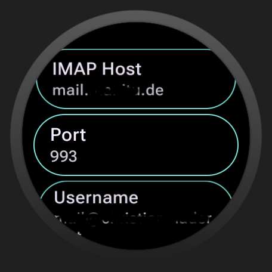
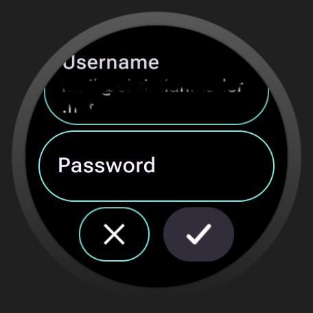
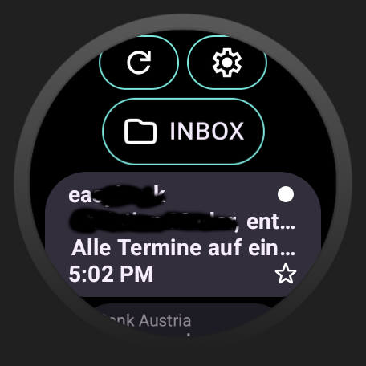
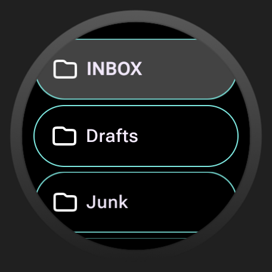
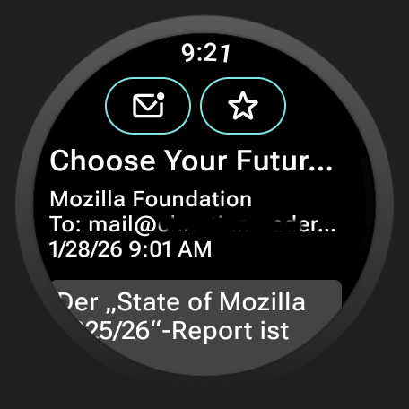
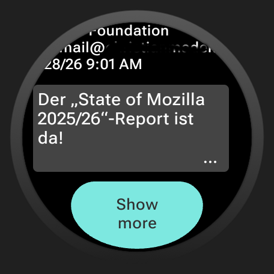

#  MailReader-WearOS

MailReader is a stand-alone Wear OS app for reading mails that reside on an (secured) IMAP server. The following
functionality is supported:

* Connection to IMAPS (IMAP over SSL/TLS) Server
* Selection of mail folder
* Tagging a mail as read and setting a flag
* Text-based view of the mail content (only reading, *NO* mail composition)

## Configuration

When the app is first started, the configuration screen appears that lets you enter the IMAP server 
connection parameters. 

These settings can be changed later by clicking the cog icon in the mail list screen.

## Mail List Screen

This screen displays a list of all mails in the selected folder.

By default, the folder `INBOX` is selected. It can be changed when tapping at the folder button
below the reload and the settings buttons.

## Folder Selection Screen

All available folders are displayed as a list in the folder selection screen.

The screen supports nested folders. Clicking on one folder selects it. If the folder contains sub-folders
it is selected and expanded.

## Mail Content Screen

When tapping an a mail in the mail list screen, the content of the mail is shown. It shows a text-based
representation of the mail content.

If the selected mail contains a textual representation (content type `text/plain`) this is the preferred
source for the mail content. However, sometimes mails are available just in HTML format, so the application
does its best to make the HTML content readable for human users as plain-text.

Mail attachments are not supported.

## Installation

To install the app you need to download the `.apk` file from
[this](https://github.com/cmader/MailReader) repository. After that, the file must be
transferred to the Wear OS device (smartwatch). There are several guides how to do this, for
example [here](https://www.makeuseof.com/sideload-apps-wear-os-galaxy-watch/) and
[here](https://xdaforums.com/t/how-to-install-apps-on-wear-os-all-methods.4510255/). Just use the
method you're most comfortable with.

### Compatibility
The app has been tested with Wear OS API level 36 with round display (1.2") in the emulator and on 
a Samsung Galaxy Watch 5.

## Changelog

* v1.0.0: Initial version

## Other Notes

If you experience any bugs or issues using the app, please contact me! The software is developed
as a personal leisure time side project with no commercial interest whatsoever. Hence no ads, nag
screens, donate buttons or other annoying stuff.

## Distribution and License
[HttpClient for Wear OS](https://github.com/cmader/HttpClient-WearOS) © 2024,2025 by
[Christian Mader](https://github.com/cmader) is licensed under
[CC BY-NC-ND 4.0](https://creativecommons.org/licenses/by-nc-nd/4.0/)

## Contributors
* [Christian Mader](https://github.com/cmader), Initiator and Developer
